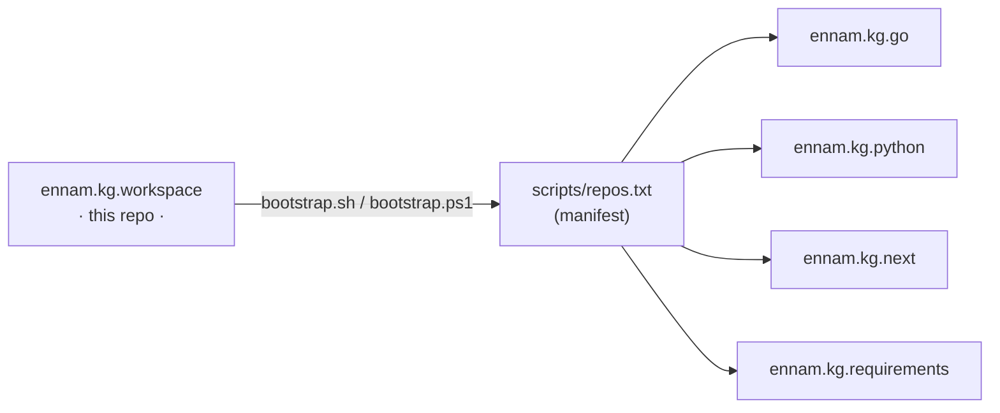

# 🧠 Ennam KG · Workspace

> One clone, one command — every Ennam KG service checked out on `main`.


This is the **workspace meta-repo**: it carries the shared config (`CLAUDE.md`,
`AGENTS.md`), the docs, and the Serena knowledge store. The actual code lives in
four independent repos that are cloned **at runtime** — they are intentionally
*not* part of this repo.


## ⭐ Star this repo

Working on Ennam KG? **Star it** — it keeps the workspace one click away in
your GitHub *Stars* and on your dashboard.

[](https://github.com/En-Nam/ennam.kg.workspace/stargazers)
[](https://github.com/En-Nam/ennam.kg.workspace/network/members)

[](https://star-history.com/#En-Nam/ennam.kg.workspace&Date)

## ✨ What you get

- 🧭 Shared `CLAUDE.md` / `AGENTS.md`, `docs/`, and the Serena knowledge store — one clone.
- ⚡ One-shot bootstrap that clones **all 4 code repos** onto `main`.
- 🧱 A single manifest (`scripts/repos.txt`) — add a repo = add a line.
- 🔒 Secrets and sub-repos kept out of git **by design**.

## 🚀 Quick start

**Prerequisites:** `git`, and an SSH key on your GitHub account with access to
the `En-Nam` org — verify with `ssh -T git@github.com` (it should greet you by
username).

```bash
# 1. Clone this workspace repo
git clone git@github.com:En-Nam/ennam.kg.workspace.git ennam.kg
cd ennam.kg

# 2. Clone all sub-repos onto main
./scripts/bootstrap.sh        # macOS / Linux / Git Bash
.\scripts\bootstrap.ps1       # Windows PowerShell
```

That's it. You now have `ennam.kg.go/`, `ennam.kg.python/`, `ennam.kg.next/`,
and `ennam.kg.requirements/` checked out on `main` — **branch off from there.**

`bootstrap` is idempotent: re-run it anytime, existing repos are skipped.

## 🧩 How it works



- **Meta-repo, not submodules.** Submodules pin a commit; we want every sub-repo
  free on `main` so you branch as you like.
- **Manifest-driven.** Both `bootstrap.sh` and `bootstrap.ps1` read the *same*
  `scripts/repos.txt` — the two scripts can never drift.
- **Safe by default.** `.gitignore` excludes the sub-repo dirs, `.env`,
  `SECRET.md`, local config, and caches; `.gitattributes` pins the scripts and
  manifest to LF so they work on every OS.

## 📦 Sub-repos

| Repo | Purpose |
|------|---------|
| `ennam.kg.go` | Go API server + MCP bridge |
| `ennam.kg.python` | Python indexing workers |
| `ennam.kg.next` | NextJS web dashboard |
| `ennam.kg.requirements` | Formal BA documentation |

> Full command reference per service lives in each sub-repo's own `CLAUDE.md`.

## ➕ Add a sub-repo

Append one line to `scripts/repos.txt` — no script change needed:

```
# dir          url                                       branch
ennam.kg.new   git@github.com:En-Nam/ennam.kg.new.git    main
```

Re-run `bootstrap` and it clones the new one (everything else is skipped).

## 🔒 Secrets

`.env` and `SECRET.md` are git-ignored and never shared. Copy `.env.example`
to `.env` and fill in values locally — ask the team lead for credentials.

