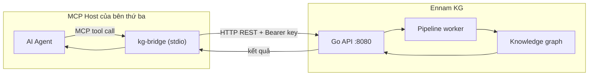
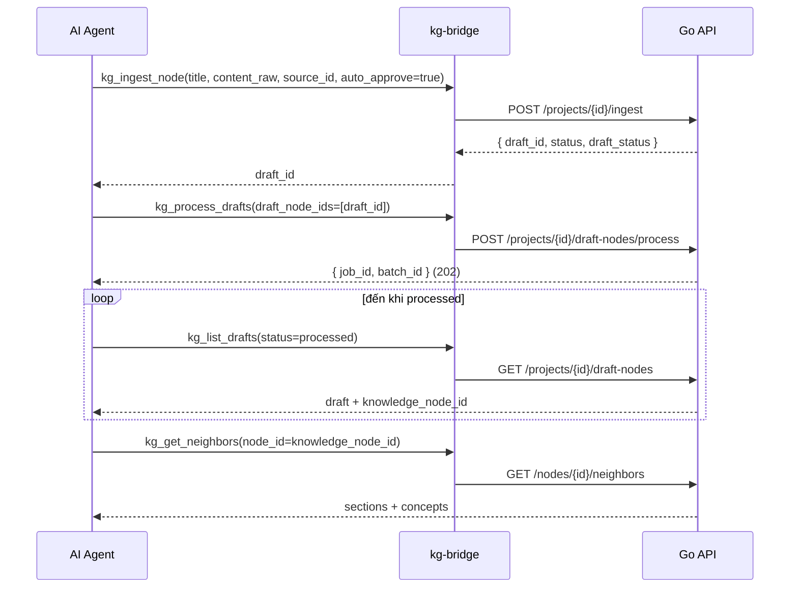

# Hướng dẫn tích hợp Ennam KG qua MCP (cho AI Agent của hệ thống bên thứ ba)

> **Đối tượng:** AI agent của hệ thống bên thứ ba chạy trong một **MCP host** (Claude Code, Cursor, hoặc bất kỳ client hỗ trợ Model Context Protocol qua stdio). Agent có thể vừa **đẩy tài liệu** vào Ennam KG, vừa **truy vấn** knowledge graph như một bộ công cụ hội thoại.
> **Khi nào dùng MCP (thay vì REST):** Agent của bạn đã sống trong MCP host và bạn muốn thao tác KG bằng *tool call* tự nhiên thay vì gọi HTTP thủ công. Nếu hệ thống của bạn là backend thuần → dùng `third-party-rest-api-integration.md`.
> **Bản chất:** `kg-bridge` là một binary MCP stdio, **dịch tool call → REST API** của Go server (không chứa business logic). Mọi validation cuối cùng vẫn ở server.

---

## 1. Kiến trúc



- Agent gọi tool (vd `kg_ingest_node`) → `kg-bridge` map sang `POST /api/v1/projects/{projectId}/ingest` → Go API.
- `kg-bridge` validate schema phía client (fast-fail) trước khi gửi; server là validator quyền lực cuối.

---

## 2. Cài đặt & cấu hình `kg-bridge`

### 2.1 Sinh file cấu hình

```bash
kg-bridge init \
  --api-key "<API_KEY>" \
  --server "http://localhost:8080" \
  --project "<PROJECT_UUID>"
```

Tạo `~/.kg/config.yaml` (quyền `0600`):

```yaml
# ~/.kg/config.yaml
api_key: "<API_KEY>"
server_url: "http://localhost:8080"   # prod: https://kg.ennam.dev
default_project_id: "<PROJECT_UUID>"  # tuỳ chọn — nếu bỏ trống phải truyền projectId mỗi tool call
```

### 2.2 Biến môi trường (ghi đè file config tại runtime)

| Env | Ý nghĩa |
|-----|---------|
| `KG_API_KEY` | API key (theo project) |
| `KG_SERVER_URL` | Base URL Go API |
| `KG_PROJECT_ID` | Project mặc định |

> API key do admin KG cấp, **scope theo project**. Thiếu/sai → tool trả lỗi `401`.

### 2.3 Đăng ký MCP server trong host

Khai báo `kg-bridge` là một MCP server qua stdio. Ví dụ (định dạng `mcp.json` / cấu hình MCP của host):

```json
{
  "mcpServers": {
    "ennam-kg": {
      "command": "kg-bridge",
      "args": ["serve"],
      "env": {
        "KG_API_KEY": "<API_KEY>",
        "KG_SERVER_URL": "http://localhost:8080",
        "KG_PROJECT_ID": "<PROJECT_UUID>"
      }
    }
  }
}
```

Host sẽ spawn `kg-bridge` như subprocess, giao tiếp qua stdio. Sau khi kết nối, agent thấy danh sách tool của Ennam KG.

---

## 3. Bộ công cụ ingest (đẩy tài liệu) — 5 tool

| Tool | Map REST | Mục đích |
|------|----------|----------|
| `kg_ingest_node` | `POST /projects/{projectId}/ingest` | Đẩy 1 tài liệu thành draft |
| `kg_ingest_batch` | `POST /projects/{projectId}/ingest/batch` | Đẩy nhiều draft trong 1 call |
| `kg_list_drafts` | `GET /projects/{projectId}/draft-nodes` | Liệt kê draft theo filter |
| `kg_approve_drafts` | `POST /projects/{projectId}/draft-nodes/bulk-approve` | Duyệt draft |
| `kg_process_drafts` | `POST /projects/{projectId}/draft-nodes/process` | Đưa draft đã duyệt vào pipeline |

### 3.1 `kg_ingest_node`

| Tham số | Bắt buộc | Ghi chú |
|---------|----------|---------|
| `projectId` | ✅ (hoặc lấy từ `default_project_id`) | UUID project |
| `title` | ✅ | Tiêu đề draft |
| `content_raw` | ✅ | Nội dung (markdown/text…) |
| `source_id` | ✅ | Định danh duy nhất, nên có prefix nguồn |
| `content_format` | — | `plain_text` / `markdown` / `json` / `csv` |
| `auto_approve` | — | `true` → bỏ qua duyệt thủ công |

Ví dụ (đối số agent truyền vào tool):

```json
{
  "projectId": "<PROJECT_UUID>",
  "title": "Báo cáo tổng hợp — Dự án X",
  "content_raw": "# X\n\nNội dung agent tổng hợp...",
  "source_id": "your-agent:job-abc-123",
  "content_format": "markdown",
  "auto_approve": true
}
```

### 3.2 `kg_ingest_batch`

```json
{
  "projectId": "<PROJECT_UUID>",
  "items": [
    { "title": "Doc 1", "content_raw": "...", "source_id": "your-agent:1", "auto_approve": true },
    { "title": "Doc 2", "content_raw": "...", "source_id": "your-agent:2" }
  ]
}
```

### 3.3 `kg_approve_drafts` / `kg_process_drafts`

```json
{ "projectId": "<PROJECT_UUID>", "draft_node_ids": ["<draft-uuid>", "..."] }
```

- `kg_approve_drafts`: duyệt (bỏ qua nếu đã `auto_approve`).
- `kg_process_drafts`: kích hoạt pipeline (bất đồng bộ). Trả `job_id`, `batch_id`.

### 3.4 `kg_list_drafts`

```json
{ "projectId": "<PROJECT_UUID>", "status": "processed", "source_type": "satellite_api", "limit": 50, "offset": 0 }
```

Dùng để theo dõi vòng đời draft và lấy `knowledge_node_id` sau khi xử lý xong.

---

## 4. Bộ công cụ truy vấn (đọc graph & trả lời)

Sau khi tài liệu đã `processed`, agent có thể tra cứu KG:

| Tool | Mục đích |
|------|----------|
| `kg_search` | Full-text search node theo từ khoá / chủ đề |
| `kg_query` | Lọc/duyệt có cấu trúc (JSON filter) |
| `kg_get_neighbors` | Node lân cận trực tiếp (1 hop) — dùng để mở rộng từ document hub sang các section/concept |
| `kg_traverse` | Duyệt graph nhiều hop |
| `kg_get_context` | Lấy ngữ cảnh tổng hợp quanh một chủ đề |

> Phía Go bridge đăng ký tổng cộng ~30 tool (store/update/query/session/link + 5 ingest). Với hệ thống bên thứ ba, **ingest (mục 3)** và **query (mục 4)** là 2 nhóm chính.

---

## 5. Quy trình agent điển hình



Gợi ý prompt cho agent của bạn:

> "Sau khi tổng hợp xong tài liệu, gọi `kg_ingest_node` với `auto_approve=true` và `source_id` theo job, rồi `kg_process_drafts`. Khi cần trả lời câu hỏi về tài liệu đã đẩy, dùng `kg_search` → `kg_get_neighbors` trên document hub để lấy các section liên quan."

---

## 6. Khác biệt MCP vs REST (chọn đúng đường)

| Tiêu chí | MCP (`kg-bridge`) | REST API |
|----------|-------------------|----------|
| Môi trường | Agent trong MCP host (Claude Code/Cursor…) | Service/backend bất kỳ |
| Cách gọi | Tool call hội thoại | HTTP request |
| Cấu hình | `~/.kg/config.yaml` + env | Header `Authorization` mỗi request |
| Chat/SSE | Không (agent dùng host của chính nó) | `POST /api/v1/agentic/stream` để nhúng chat |
| Upload file nhị phân | Dùng REST `ingest/upload` | ✅ Có |

> Hai cách **dùng chung** cùng draft pipeline và cùng knowledge graph — có thể kết hợp: agent đẩy qua MCP, dashboard/REST đọc graph.

---

## 7. Lưu ý & xử lý lỗi

- Validation 2 lớp: bridge (schema, fast-fail) + server (Gate 1/Gate 2). Lỗi schema trả ngay tại tool, không tốn round-trip.
- `source_id` nên **ổn định, có prefix** → upsert idempotent, tránh trùng khi agent chạy lại.
- `kg_process_drafts` là **bất đồng bộ** — đừng giả định xong ngay; poll qua `kg_list_drafts`.
- Lỗi auth (`401`), rate limit (`429`), not found (`404`) được trả về dưới dạng nội dung tool — agent nên đọc và xử lý, không bỏ qua.
- Tên tool chính xác là **`kg_ingest_node`** (một số ghi chú nội bộ cũ dùng `kg_ingest_document` — không đúng với bridge hiện tại).

---

## 8. Tham chiếu yêu cầu

- BA-002 — MCP Bridge (Agent Integration): kiến trúc bridge, cấu hình, tool query.
- BA-024 — Public Ingestion API & Cross-Source Intelligence (§FR-002): 5 MCP tool ingest.
- BA-022 / BA-023 — draft node lifecycle, upload.
- BA-025 — Document Decomposition & Retrieval.
