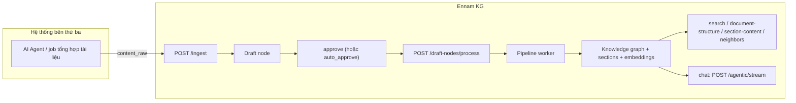

# Hướng dẫn tích hợp Ennam KG qua REST API (cho hệ thống bên thứ ba)

> **Đối tượng:** Backend / service của hệ thống bên thứ ba (Java, .NET, Node, Python, Go…) muốn **đẩy tài liệu** vào Ennam Knowledge Graph để tạo knowledge graph và cho phép chat/tra cứu.
> **Khi nào dùng REST (thay vì MCP):** Hệ thống của bạn là service thông thường, **không** chạy trong môi trường MCP host (Claude Code / Cursor). Nếu AI agent của bạn chạy trong MCP host, xem thêm `third-party-mcp-integration.md`.
> **Phiên bản API:** Phase 6 (BA-022 / BA-023 / BA-024 / BA-025).

---

## 1. Mô hình tổng quan



**5 bước chuẩn:**

1. `POST .../ingest` — đẩy tài liệu vào KG dưới dạng *draft node*.
2. Duyệt draft: `auto_approve: true` (tự động) **hoặc** gọi approve thủ công.
3. `POST .../draft-nodes/process` — đưa draft đã duyệt vào hàng đợi xử lý AI.
4. Poll trạng thái đến khi `processed`, lấy `knowledge_node_id`.
5. Đọc graph / mở chat (dashboard hoặc API).

---

## 2. Thông tin kết nối & xác thực

| Mục | Giá trị |
|-----|---------|
| Base URL (Go API) | Local: `http://localhost:8080` · Prod: theo cấu hình triển khai (vd `https://kg.ennam.dev`) |
| Header xác thực | `Authorization: Bearer <API_KEY>` |
| Phạm vi API key | Theo **project** — mỗi key gắn với một project |
| Định dạng body | `application/json` (trừ upload file dùng `multipart/form-data`) |
| `project_id` | UUID của project, nằm trên đường dẫn URL |

> API key do admin KG cấp. Tất cả request `/api/v1/...` đều cần header `Authorization`. Thiếu/sai key → `401 Unauthorized`.

---

## 3. Đẩy tài liệu — `POST /api/v1/projects/{projectId}/ingest`

Tạo (hoặc cập nhật) **một** draft node.

**Request body:**

```json
{
  "title": "Báo cáo tổng hợp — Dự án X",
  "content_raw": "# Tiêu đề\n\nNội dung markdown đầy đủ do agent tổng hợp...",
  "source_id": "your-system:job-abc-123",
  "content_format": "markdown",
  "auto_approve": true,
  "metadata": { "origin": "your-platform", "job_id": "abc-123" }
}
```

**Trường:**

| Trường | Bắt buộc | Ghi chú |
|--------|----------|---------|
| `title` | ✅ | 1–500 ký tự |
| `content_raw` | ✅ | 1–100.000 ký tự (nội dung tài liệu) |
| `source_id` | ✅ | Định danh duy nhất trong project. Nên có prefix hệ thống, vd `your-system:...` |
| `content_format` | — | `text` (mặc định), `markdown`, `html`, `json`, `csv`, `binary` |
| `auto_approve` | — | `true` → bỏ qua duyệt thủ công, sẵn sàng xử lý |
| `metadata` | — | JSON tuỳ ý, lưu kèm draft |

> **`source_type` luôn là `satellite_api`** cho API công khai — bạn không cần (và không được) tự đặt. Phân biệt nguồn bằng prefix trong `source_id`.

**Response `201 Created`:**

```json
{
  "draft_id": "f268ae05-591e-4922-8ec8-11c807c559fd",
  "status": "created",
  "draft_status": "approved"
}
```

| Trường | Ý nghĩa |
|--------|---------|
| `draft_id` | UUID draft — dùng cho process / poll |
| `status` | `created` (mới) hoặc `updated` (upsert do trùng `source_id`) |
| `draft_status` | Trạng thái draft: `pending` hoặc `approved` (khi `auto_approve`) |

**Tính idempotent:** Gửi lại cùng `source_id` → **cập nhật** draft cũ (`title`, `content_raw`, `content_format`, `metadata`), không tạo bản trùng. Nếu draft trước đó `rejected`, trạng thái reset về `pending`.

---

## 4. Đẩy theo lô — `POST /api/v1/projects/{projectId}/ingest/batch`

Tối đa **100 item** / request.

**Request:**

```json
{
  "items": [
    { "title": "Doc 1", "content_raw": "...", "source_id": "your-system:1", "auto_approve": true },
    { "title": "Doc 2", "content_raw": "...", "source_id": "your-system:2" }
  ]
}
```

**Response `200 OK` (toàn bộ thành công) hoặc `207 Multi-Status` (có item lỗi):**

```json
{
  "results": [
    { "draft_id": "uuid-1", "status": "created", "draft_status": "approved" },
    { "draft_id": "",       "status": "",        "draft_status": "", "error": "title is required" }
  ]
}
```

Từng item độc lập — item lỗi **không** rollback các item thành công. Quá 100 item → `400` (`batch size exceeded`).

---

## 5. Đẩy file trực tiếp — `POST /api/v1/projects/{projectId}/ingest/upload`

Khi bạn có **file** (`.md`, `.pdf`, `.docx`, `.csv`, `.xlsx`…) thay vì chuỗi `content_raw`. Dùng `multipart/form-data`.

| Field | Ghi chú |
|-------|---------|
| `file` | File đính kèm (hoặc `files` cho nhiều file) |
| `title` | Tiêu đề |
| `source_id` | Định danh duy nhất |
| `auto_approve` | `true` / `false` |

```bash
curl -X POST "http://localhost:8080/api/v1/projects/${PROJECT_ID}/ingest/upload" \
  -H "Authorization: Bearer ${API_KEY}" \
  -F "file=@report.md" \
  -F "title=Báo cáo X" \
  -F "source_id=your-system:report-x" \
  -F "auto_approve=true"
```

Tham khảo script mẫu: `scripts/ingest-md-via-api.sh`.

---

## 6. Duyệt draft (nếu không dùng `auto_approve`)

| Method & Path | Mục đích |
|---------------|----------|
| `GET /api/v1/projects/{projectId}/draft-nodes?status=pending&source_type=satellite_api&limit=50&offset=0` | Liệt kê draft → `{ draft_nodes, total_count, limit, offset }` |
| `GET /api/v1/projects/{projectId}/draft-nodes/{draftId}` | Chi tiết 1 draft (gồm `status`, `knowledge_node_id`) |
| `POST /api/v1/projects/{projectId}/draft-nodes/{draftId}/approve` | Duyệt 1 draft |
| `POST /api/v1/projects/{projectId}/draft-nodes/bulk-approve` | Duyệt nhiều: body `{ "draft_node_ids": ["uuid", ...] }` |
| `POST /api/v1/projects/{projectId}/draft-nodes/{draftId}/reject` | Từ chối |

Vòng đời draft: `pending → approved → processing → processed` (hoặc `failed`; `failed → pending` để retry).

---

## 7. Xử lý draft → knowledge graph — `POST /api/v1/projects/{projectId}/draft-nodes/process`

Đưa các draft **đã approve** vào hàng đợi pipeline (trích xuất entity, tạo node, sinh section + embedding, liên kết cross-source).

**Request:**

```json
{ "draft_node_ids": ["f268ae05-591e-4922-8ec8-11c807c559fd"] }
```

**Response `202 Accepted`:**

```json
{
  "job_id": "…",
  "batch_id": "…",
  "draft_node_ids": ["f268ae05-591e-4922-8ec8-11c807c559fd"]
}
```

Xử lý là **bất đồng bộ** — worker chạy nền. Poll trạng thái ở bước 8.

---

## 8. Theo dõi trạng thái

```
GET /api/v1/projects/{projectId}/ingest/status/{draftId}
```

```json
{
  "draft_id": "f268ae05-591e-4922-8ec8-11c807c559fd",
  "status": "processed",
  "knowledge_node_id": "06a4715c-c18e-4384-8754-e62a569be890"
}
```

Poll đến khi `status = "processed"`. `knowledge_node_id` là **document hub** trong knowledge graph — dùng để mở graph/chat hoặc truy vấn cấu trúc.

---

## 9. Sau khi có graph — đọc dữ liệu & chat

### 9.1 Tìm kiếm node

```
POST /api/v1/search
{ "query": "red flags CRITICAL", "project_id": "<uuid>", "node_types": ["document_section","document","concept"], "limit": 15 }
```

Trả `{ results, total_count, limit, offset, query }`. (Hỗ trợ semantic khi gửi `semantic: true` + `query_embedding`.)

### 9.2 Cấu trúc tài liệu (cây heading)

```
GET /api/v1/nodes/{knowledge_node_id}/document-structure
→ { node_id, title, document_tree, section_count }
```

### 9.3 Nội dung 1 section

```
GET /api/v1/nodes/{section_node_id}/section-content
→ { node_id, title, summary, content, document_id, line_start, line_end }
```

### 9.4 Node lân cận (graph)

```
GET /api/v1/nodes/{node_id}/neighbors?project_id=<uuid>
→ { node_id, neighbors: [ { id, node_type, title, edge_type, direction, ... } ], total_count, limit, offset }
```

### 9.5 Chat (nhúng vào UI của bạn) — SSE

Qua Python indexer (mặc định `:8081`):

```
POST /api/v1/agentic/stream     (text/event-stream)
{
  "project_id": "<uuid>",
  "query": "Liệt kê 10 red flags CRITICAL của báo cáo X",
  "thread_id": "<id hội thoại>",
  "message_id": "<id tin nhắn>",
  "tier": "deep"
}
```

- `tier`: `quick` (≤3 tool calls) hoặc `deep` (≤12, có truy vấn document-structure/section-content + semantic).
- `data_source_id` để trống nếu chỉ hỏi trên KG (chế độ kg-only).
- Hệ thống của bạn đọc luồng SSE và render dần.

> **Nhanh nhất:** thay vì tự dựng UI, mở dashboard KG: `/{...}/graph?focus={knowledge_node_id}` rồi dùng chat sẵn có.

---

## 10. Mã lỗi thường gặp

| HTTP | Nguyên nhân |
|------|-------------|
| `400` | Thiếu trường bắt buộc, vượt giới hạn (title/content_raw/batch) |
| `401` | Thiếu/sai API key |
| `404` | Không tìm thấy draft/node |
| `207` | Batch có item lỗi (xem `error` từng item) |
| `429` | Vượt rate limit (mặc định 100 req/phút/key) — đọc header `Retry-After` |
| `5xx` | Lỗi server — retry với backoff |

---

## 11. Khuyến nghị tích hợp

- **`source_id` ổn định, có prefix** theo hệ thống nguồn → tận dụng upsert, tránh trùng khi gửi lại.
- **Chỉ đẩy bản tổng hợp cuối** (output của agent), không cần đẩy toàn bộ file thô — KG sẽ tự phân rã section + embedding (Phase 6.2) để chat tra cứu chi tiết.
- Với nguồn tin cậy nội bộ: `auto_approve: true` + gọi `process` ngay sau ingest để rút ngắn pipeline.
- Poll `ingest/status` với backoff (vd 2s → 5s → 10s), timeout hợp lý (~90s).
- **Fail loud:** log rõ `draft_id`, `job_id`, HTTP code khi lỗi; không nuốt lỗi.

---

## 12. Ví dụ end-to-end (bash)

```bash
API_URL="http://localhost:8080"
API_KEY="<API_KEY>"
PROJECT_ID="<PROJECT_UUID>"

# 1) Ingest + auto-approve
DRAFT_ID=$(curl -s -X POST "$API_URL/api/v1/projects/$PROJECT_ID/ingest" \
  -H "Authorization: Bearer $API_KEY" -H "Content-Type: application/json" \
  -d '{"title":"Báo cáo X","content_raw":"# X\n...","source_id":"your-system:x","content_format":"markdown","auto_approve":true}' \
  | python3 -c "import sys,json;print(json.load(sys.stdin)['draft_id'])")

# 2) Process
curl -s -X POST "$API_URL/api/v1/projects/$PROJECT_ID/draft-nodes/process" \
  -H "Authorization: Bearer $API_KEY" -H "Content-Type: application/json" \
  -d "{\"draft_node_ids\":[\"$DRAFT_ID\"]}"

# 3) Poll
for i in $(seq 1 30); do
  R=$(curl -s "$API_URL/api/v1/projects/$PROJECT_ID/ingest/status/$DRAFT_ID" -H "Authorization: Bearer $API_KEY")
  echo "$R"
  echo "$R" | grep -q '"processed"' && break
  sleep 3
done
```

---

## 13. Tham chiếu yêu cầu

- BA-022 — Unified Ingestion Framework & Draft Nodes
- BA-023 — Source Adapters & File Processing (upload)
- BA-024 — Public Ingestion API & Cross-Source Intelligence
- BA-025 — Document Decomposition & Retrieval (document-structure / section-content / semantic)
