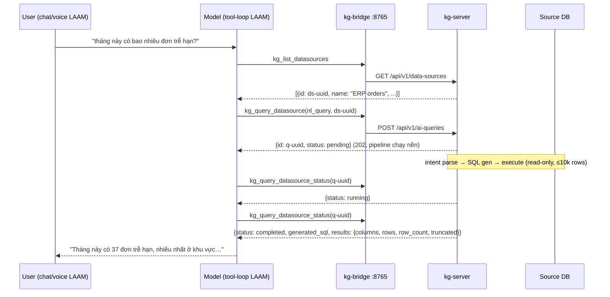

# Spec: MCP tools `kg_query_datasource` — mở NL→SQL pipeline ra MCP bridge

**Ngày:** 2026-07-31
**Người yêu cầu:** LAAM team (consumer của kg-bridge qua MCP)
**Trạng thái:** Draft — chờ DAAB team review 2 quyết định mở ở §7
**Phạm vi sửa:** CHỈ `ennam.kg.go/internal/bridge/` (schema + routing + test). KHÔNG sửa handler/service/store.

---

## 1. Bối cảnh & mục tiêu

LAAM đang consume DAAB qua MCP bridge (`:8765/mcp`, passthrough auth) với ~45 tool `kg_*`.
Qua MCP hiện truy vấn được:

- ✅ Tài liệu thô: `kg_search` / `kg_search_chunks` / `kg_get_document*`
- ✅ Metadata schema DB (node `architecture` / `schema_table` do KGGenerator sinh)
- ❌ **Dữ liệu DÒNG (rows) của DB nguồn** — "đơn hàng #123 trạng thái gì?", "tháng này bao nhiêu đơn trễ?"

Trong khi đó pipeline trả lời chính xác câu này **đã chạy production** cho web app DAAB
(NL → intent parse → SQL generate → execute read-only), chỉ là chưa có tool MCP nào trỏ vào.

**Mục tiêu:** thêm 3 tool MCP (đúng pattern bridge hiện có, zero code mới ngoài bridge) để mọi
MCP consumer (LAAM chat/voice, agents khác) hỏi được dữ liệu row-level bằng tiếng tự nhiên.

## 2. Hiện trạng — những gì ĐÃ có (không build lại)

| Thành phần | File | Ghi chú |
|---|---|---|
| Pipeline NL→SQL→Execute | `internal/service/nl_query.go` (`NLQueryService.ProcessQuery`) | intent parse (biết trả `clarification_needed`), SQL gen tham số hoá, auto-retry đơn giản hoá 1 lần |
| Executor an toàn | `internal/service/source_executor.go` | read-only, single-use connection, **max 10 000 rows**, timeout 30s, conn-string AES |
| HTTP API async | `internal/handler/ai_query.go` `RegisterRoutes` | `POST /api/v1/ai-queries` → 202 + record; `GET /api/v1/ai-queries/{id}` → status/results; RBAC `requireProjectRole(developer)` |
| List datasource | `internal/handler/datasource.go:85` | `GET /api/v1/data-sources` (List) |
| Bridge routing khai báo | `internal/bridge/client.go` (`toolRoutes`) | 1 tool = 1 entry `ToolRoute{Method, PathTemplate, PathParams, QueryParams, Class}` |
| Bridge schema/validation | `internal/bridge/schema.go` (`buildToolSchemas`) | 1 tool = 1 `ToolSchema` (param validation trước khi proxy) |
| ReadOnlyHint tự động | `internal/bridge/serve.go:233-238` | `Class == RouteRead` → advertise `readOnlyHint: true` cho MCP client (LAAM skip confirm-card) |
| Default project | `internal/bridge/serve.go:92-93` | header `X-KG-Project-Id` per-request → `cfg.DefaultProjectID` |
| Pattern async mẫu | cặp `kg_index_source` / `kg_index_status` | submit-rồi-poll đã là pattern quen của bridge |

## 3. Thiết kế 3 tool mới

### 3.1 `kg_query_datasource` — submit câu hỏi

Map: `POST /api/v1/ai-queries` (async — trả về ngay `query_id`, KHÔNG chờ kết quả).

```go
// client.go — toolRoutes
"kg_query_datasource": {
    Method:       http.MethodPost,
    PathTemplate: apiPrefix + "/ai-queries",
    Class:        RouteRead, // xem quyết định §7.1
},
```

```go
// schema.go
schemas["kg_query_datasource"] = &ToolSchema{
    ToolName: "kg_query_datasource",
    Description: "Ask a natural-language question about the ROWS of a connected source database " +
        "(e.g. \"how many orders are overdue this month?\"). Returns a query_id immediately; " +
        "poll kg_query_datasource_status to get the rows. Use kg_list_datasources first if you " +
        "don't know the data_source_id. For questions about the DB's STRUCTURE (tables, columns, " +
        "relationships) use kg_search with node_types [\"architecture\"] instead.",
    Properties: map[string]ParamSchema{
        "natural_language_query": {
            Type: TypeString, Required: true, MinLength: intPtr(1), MaxLength: intPtr(1000),
            Description: "The question about the data, in natural language (Vietnamese or English)",
        },
        "data_source_id": {
            Type: TypeString, Required: true, Format: "uuid", Pattern: uuidPattern,
            Description: "UUID of the connected data source (from kg_list_datasources)",
        },
        "project_id": {
            Type: TypeString, Required: false,
            Description: "Optional project id (falls back to the default project)",
        },
    },
}
```

Response (pass-through từ handler): record `AIQuery` — `{id, status: "pending", ...}`.
Description CỐ Ý nêu rõ (a) phải poll, (b) phân luồng structure-question sang `kg_search` —
đây là chỗ dạy model chọn đúng tool, đã đo được là quyết định chất lượng (LAAM E2E 06-2026).

### 3.2 `kg_query_datasource_status` — poll kết quả

Map: `GET /api/v1/ai-queries/{id}`.

```go
"kg_query_datasource_status": {
    Method:       http.MethodGet,
    PathTemplate: apiPrefix + "/ai-queries/{id}",
    PathParams:   []string{"id"},
    Class:        RouteRead,
},
```

```go
schemas["kg_query_datasource_status"] = &ToolSchema{
    ToolName: "kg_query_datasource_status",
    Description: "Poll a datasource query by query_id. Status: pending|running -> poll again; " +
        "completed -> read results (columns, rows, row_count, truncated); " +
        "clarification_needed -> ask the user the clarification question and submit a refined query; " +
        "failed -> report the error, do not retry more than once.",
    Properties: map[string]ParamSchema{
        "id": {
            Type: TypeString, Required: true, Format: "uuid", Pattern: uuidPattern,
            Description: "query_id returned by kg_query_datasource",
        },
        "project_id": {
            Type: TypeString, Required: false,
            Description: "Optional project id (falls back to the default project)",
        },
    },
}
```

Description mã hoá luôn **state machine cho model**: từng status phải làm gì (poll tiếp / đọc rows /
hỏi lại user / dừng). Không dựa vào model tự đoán.

### 3.3 `kg_list_datasources` — discovery (chống bài "UUID đục")

Map: `GET /api/v1/data-sources`.

```go
"kg_list_datasources": {
    Method:       http.MethodGet,
    PathTemplate: apiPrefix + "/data-sources",
    QueryParams:  []string{"project_id"}, // ⚠️ verify tên query param thật của handler List
    Class:        RouteRead,
},
```

```go
schemas["kg_list_datasources"] = &ToolSchema{
    ToolName: "kg_list_datasources",
    Description: "List connected source databases (id, name, type, sync status) for the project. " +
        "Call this to discover the data_source_id needed by kg_query_datasource.",
    Properties: map[string]ParamSchema{
        "project_id": {
            Type: TypeString, Required: false,
            Description: "Optional project id (falls back to the default project)",
        },
    },
}
```

Bài học từ `project_id` (LAAM E2E): model KHÔNG tự bịa được UUID — bắt buộc có tool list
để nó lấy ID vào ngữ cảnh trước. Không có tool này thì 2 tool trên gần như vô dụng với agent.

## 4. Flow end-to-end (nhìn từ LAAM)



Nhánh `clarification_needed`: status trả kèm câu hỏi làm rõ → model hỏi lại user →
submit `kg_query_datasource` mới với câu đã tinh chỉnh (KHÔNG có API "answer clarification"
qua bridge trong scope này — giữ đơn giản).

## 5. Các bước implement (checklist)

Tất cả trong `ennam.kg.go/internal/bridge/`:

1. [ ] `client.go` — thêm 3 entry `toolRoutes` (§3). Verify tên query param của
       `GET /api/v1/data-sources` (List) trước khi chốt `QueryParams`.
2. [ ] `schema.go` — thêm 3 `ToolSchema` (§3); cập nhật comment đếm tổng tool (45 → 48,
       "42 HTTP-proxy" → 45).
3. [ ] Test — theo pattern test hiện có:
   - `schema_test.go`: 3 schema mới hợp lệ, required/pattern đúng; cross-check route↔schema
     (bảng nào thiếu bảng kia phải fail — test này ĐÃ tồn tại, chỉ cần nó xanh).
   - `client_test.go`: route mapping đúng method/path/pathparams cho 3 tool.
   - `serve_test.go` / `e2e_tools_test.go`: `tools/list` chứa 3 tool mới, cả 3 mang
     `readOnlyHint: true` (vì Class=RouteRead); gọi `kg_query_datasource_status` với id
     giả → proxy đúng path.
   - Readonly-scope gate: key readonly gọi được cả 3 (nếu chốt §7.1 = Read).
4. [ ] Docs — thêm mục vào `docs/deploy-mcp-bridge.md` (danh sách tool + ví dụ curl).
5. [ ] KHÔNG đụng: handler, service, store, frontend. Không migration.

**Ước lượng:** ~nửa ngày dev đã quen codebase (copy pattern `kg_ingest_status`), phần lớn là test.

## 6. Edge cases & ràng buộc

- **Kết quả lớn:** 10k rows JSON có thể rất to. LAAM đã chịu được 200k ký tự/kết quả MCP
  (nâng trần vì `kg_get_master_record`), nhưng nên khuyên trong description model dùng câu hỏi
  có aggregate/limit. KHÔNG cần bridge cắt thêm — `truncated` flag đã có từ executor.
- **Poll etiquette:** model có thể poll dồn dập. Chấp nhận ở v1 (mỗi call là 1 GET rẻ);
  nếu thành vấn đề → §7.2 long-poll.
- **RBAC:** `POST /api/v1/ai-queries` yêu cầu role developer trên project — key consumer
  của LAAM phải có role đó, nếu không sẽ 403 (fail đúng, không cần code thêm).
- **`kg_end_session` precedent:** bridge đã có tool POST-nhưng-mutate xếp Write; ngược lại
  `kg_query_datasource` là POST-nhưng-bản-chất-đọc → xếp Read cần ghi chú rõ trong code
  comment để khỏi bị "sửa cho nhất quán" sau này (xem §7.1).
- **Không thêm raw-SQL tool** (`kg_execute_sql`) trong scope này: bề mặt tấn công lớn hơn
  hẳn (model sinh SQL trực tiếp), trong khi NL path đã có guard (parser + generator tham số
  hoá + read-only). Nếu sau này cần, làm spec riêng.

## 7. Hai quyết định mở — cần DAAB chốt trước khi code

### 7.1 Class của `kg_query_datasource`: **Read (đề xuất)** hay Write?

- Nó INSERT một record `ai_query` (audit trail) nhưng **bản chất là đọc dữ liệu nguồn**
  (executor read-only, connection single-use).
- Nếu xếp **Write**: mọi MCP client tôn trọng hint (LAAM) sẽ bắt user bấm confirm **mỗi câu
  hỏi** → phá hoàn toàn use-case voice. Readonly-scope key cũng bị chặn.
- Đề xuất: **RouteRead**, kèm comment giải thích record ai_query chỉ là audit-side-effect.

### 7.2 Long-poll (`wait_seconds`) — làm ngay hay để sau?

Thêm query param `wait_seconds` (≤25, dưới timeout 30s của LAAM MCP client) vào
`GET /api/v1/ai-queries/{id}` để chờ tới khi hết pending/running → giảm số round poll
với voice. **Đề xuất: để sau** (touching handler = ngoài scope bridge-only; async thuần
đã chạy được).

## 8. Acceptance criteria

1. `tools/list` trả 48 tool; 3 tool mới có schema đúng §3 và `readOnlyHint: true`.
2. Gọi tuần tự bằng KG key thật (curl hoặc LAAM): list datasources → submit câu hỏi thật
   → poll tới `completed` → nhận `columns/rows/row_count`.
3. Từ LAAM (không sửa gì phía LAAM): sau ≤30s cache, chat hỏi được câu row-level end-to-end,
   voice không bị chặn confirm-card.
4. Toàn bộ test bridge hiện có + test mới xanh; cross-check route↔schema pass.
5. Key readonly-scope gọi được cả 3 tool (theo chốt §7.1).
