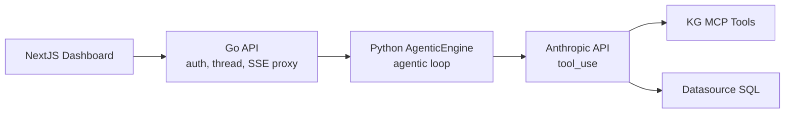
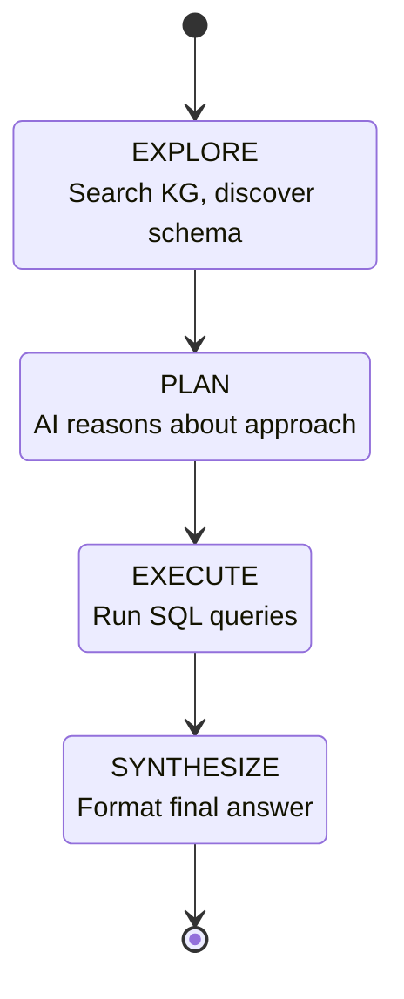
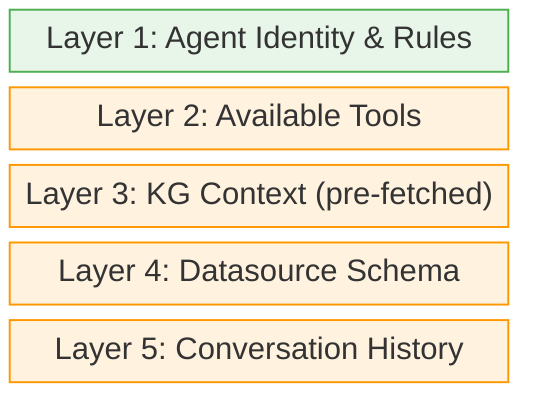
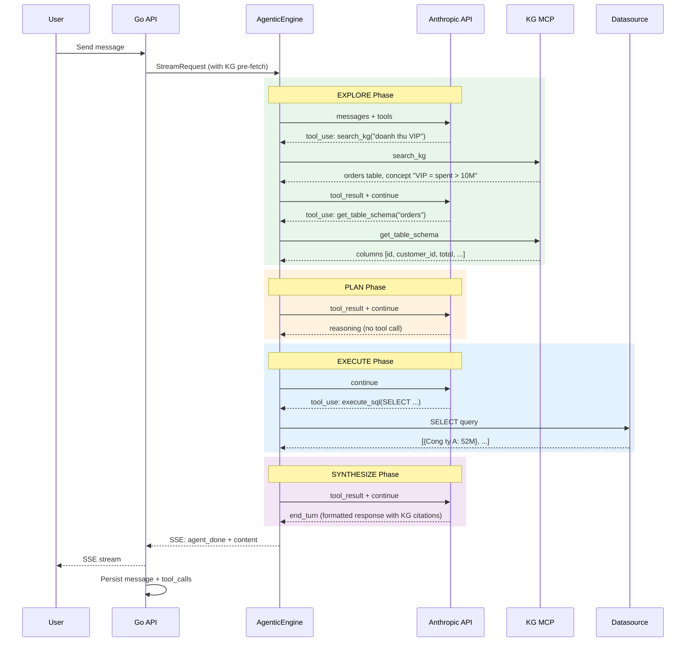
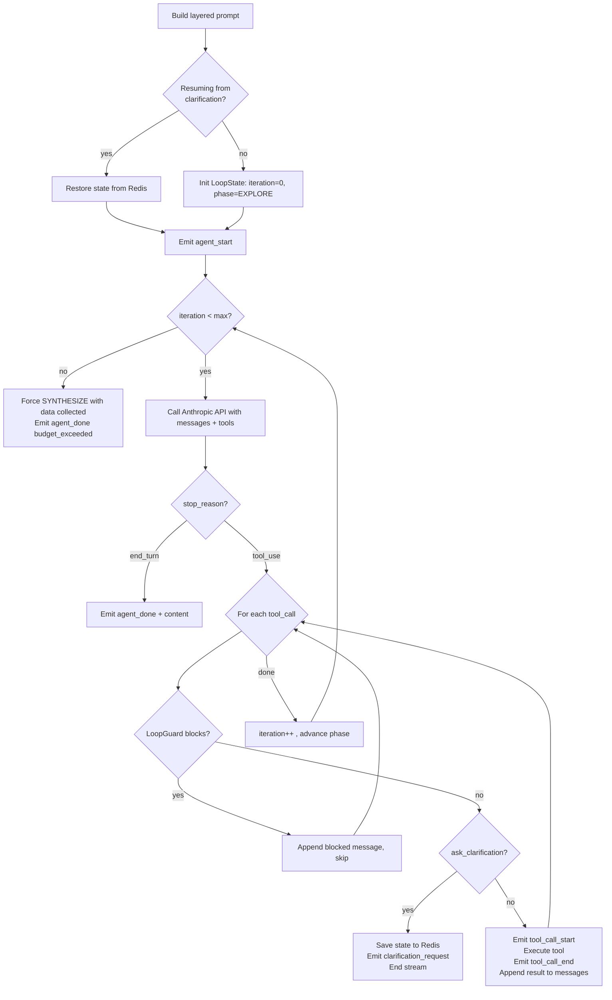
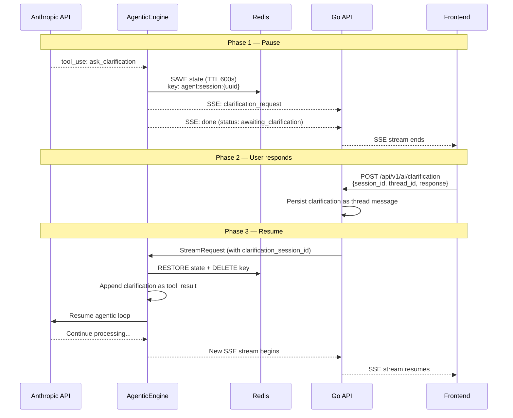
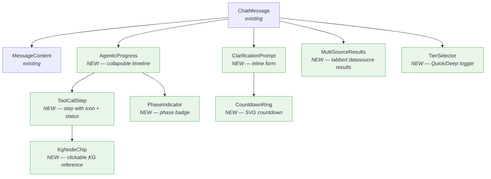
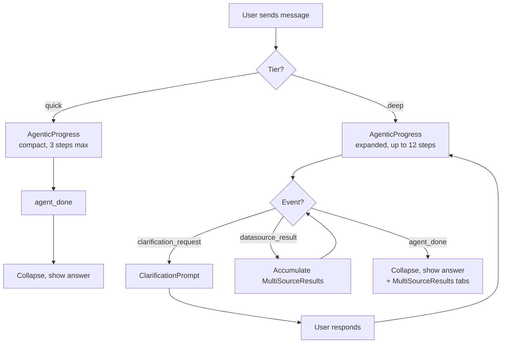
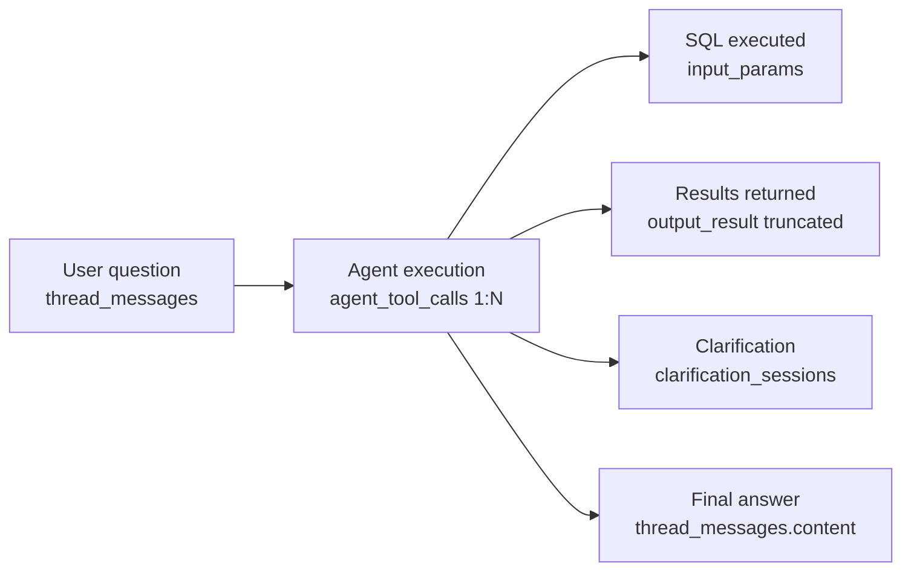

# Agentic AI Chat Engine — Design Spec

**Date**: 2026-05-11
**Status**: Approved
**Scope**: Transform Chat/AI from one-shot SQL generator to iterative agentic system with tool-calling

---

## 1. Architecture Overview & Agent State Machine

### 1.1 High-Level Architecture



- **Go API**: Auth, thread management, KG context pre-fetch, SSE proxy, persistence
- **Python AgenticEngine**: New `ennam_kg/agentic/` package — runs the agentic loop
- **Anthropic API**: Called directly via `AnthropicDirectClient._client.messages.create()` (bypasses Go proxy which is a no-op for `tool_use`)
- **Backward compatible**: Existing `StreamingQueryEngine` stays untouched. New engine runs on separate `/agentic/stream` path

### 1.2 Agent State Machine



| Phase | Purpose | Allowed Tools | Max Calls |
|-------|---------|---------------|-----------|
| EXPLORE | Search KG, discover schema | search_kg, get_neighbors, get_table_schema, list_datasources | Quick: 2, Deep: 5 |
| PLAN | AI reasons about approach | None (internal reasoning turn) | 1 turn |
| EXECUTE | Run SQL queries | execute_sql | Quick: 1, Deep: 3 |
| SYNTHESIZE | Format final answer | None (generates response) | 1 turn |

### 1.3 Tiered Execution

| Aspect | Quick Mode | Deep Mode |
|--------|-----------|-----------|
| Max tool calls | 3 | 12 |
| Max tokens | 30K | 100K |
| Timeout | 5 min | 10 min |
| Datasources | Single | Multiple (federated) |
| Tools available | 4 (search_kg, get_table_schema, execute_sql, ask_clarification) | All 7 |
| Default | Yes | User selects |

---

## 2. System Prompt Design & Tool Call Strategy

### 2.1 Layered Prompt Architecture



| Layer | Content | Lifecycle |
|-------|---------|-----------|
| 1 | Agent Identity & Rules | Fixed, load once |
| 2 | Available Tools | Dynamic per tier |
| 3 | KG Context (pre-fetched) | Dynamic per query (Go injects) |
| 4 | Datasource Schema | Dynamic per datasource |
| 5 | Conversation History | From context_messages (fixes current bug) |

**Layer 1 — Agent Identity** (shared across tiers):
```
You are an AI analyst for the Ennam Knowledge Graph platform.
Your job: answer user questions by searching the knowledge graph
and querying connected datasources.

Rules:
- ALWAYS search KG first before writing SQL
- ONLY generate SELECT statements — never INSERT/UPDATE/DELETE/DROP
- When uncertain, use ask_clarification instead of guessing
- Cite KG nodes by ID when referencing discovered information
- If a query spans multiple datasources, execute each separately
```

**Layer 2 — Tool Definitions by Tier**:

| Tool | Quick | Deep | Purpose |
|------|-------|------|---------|
| search_kg | Yes | Yes | Search KG nodes/edges |
| get_neighbors | No | Yes | Traverse graph relationships |
| get_table_schema | Yes | Yes | Get table columns before SQL |
| execute_sql | Yes | Yes | Run SELECT on datasource |
| list_datasources | No | Yes | List available datasources |
| ask_clarification | Yes | Yes | Pause to ask user |
| traverse_path | No | Yes | Find shortest path between nodes |

**Layer 3 — KG Context Injection**: Go pre-fetches `kg_search` with user query and injects results (tables, schemas, decisions, concepts) into the system prompt before sending to Python.

**Layer 5 — Conversation History**: Fixes the critical bug where `context_messages` is assembled by Go but ignored by Python (TODO at engine.py:210).

### 2.2 Tool Call Flow Example

**Example**: User asks "Doanh thu thang nay cua cac khach hang VIP la bao nhieu?"



### 2.3 Anti-Patterns & LoopGuard

| Anti-pattern | Detection | Action |
|---|---|---|
| Identical repeat | Same tool + same params 2x consecutive | Skip tool, force next phase |
| Circular exploration | Visited same KG node 3+ times | Inject "You already explored this node" |
| Budget exceeded | Tool calls > tier limit | Force SYNTHESIZE with data collected |

**Prompt-level anti-patterns** (injected into Layer 1):
- Never call search_kg with the exact same query twice
- Never call execute_sql without first calling get_table_schema
- Never generate SQL with SELECT * — always specify columns
- Never assume table relationships without checking KG edges
- Max 3 SQL queries per question (Quick mode)

### 2.4 Prompt Tier Differences

| Aspect | Quick Mode Prompt | Deep Mode Prompt |
|--------|------------------|------------------|
| Opening | "Answer quickly and concisely" | "Analyze thoroughly, explore connections" |
| Tool guidance | "Use max 3 tool calls" | "Use up to 12 tool calls, explore deeply" |
| SQL guidance | "One datasource only" | "May query multiple datasources if needed" |
| Output format | "Brief answer with data" | "Detailed analysis with insights and KG citations" |
| Clarification | "Only ask if truly ambiguous" | "Ask if it would significantly improve accuracy" |

---

## 3. Implementation Architecture

### 3.1 Module Structure

```
ennam_kg/
  agentic/                        <- NEW package
    __init__.py
    engine.py                     <- AgenticEngine (main loop, ~300 lines)
    tools.py                      <- KGToolFactory (tool definitions + executors, ~200 lines)
    multi_db.py                   <- MultiDBManager (cross-datasource, ~80 lines)
    state_store.py                <- AgentStateStore (Redis, ~40 lines)
    types.py                      <- Dataclasses (ToolDef, ToolResult, AgentConfig, LoopState, ~30 lines)
    loop_guard.py                 <- LoopGuard (anti-pattern detection)
    prompts.py                    <- Prompt builder (layered prompt assembly)
  streaming/
    engine.py                     <- StreamingQueryEngine (UNCHANGED)
    prompts.py                    <- Existing prompts (UNCHANGED)
```

### 3.2 AgenticEngine Core Loop

`AgenticEngine.stream(req)` is an async generator that yields SSE events. Its behavior:



**Dependencies**: `AnthropicDirectClient` (direct SDK call), `KGToolFactory`, `AgentStateStore`, `LoopGuard`

**Key constraint**: Must call `self.ai._client.messages.create()` directly — the Go proxy wrapper ignores `tool_use`.

### 3.3 KGToolFactory

- `get_definitions(tier)`: Returns Anthropic `tool_use` format definitions, filtered by tier (4 for quick, 7 for deep)
- `execute(tool_call)`: Routes to appropriate executor (`_exec_search_kg`, `_exec_get_neighbors`, etc.)
- `_truncate_result(result)`: Enforce token budget per tool result (4000 chars max, except schema which is never truncated)

### 3.4 execute_sql Security Layer

Three-layer validation in `_exec_execute_sql`:

1. **SQL validation**: Must start with SELECT/WITH, no DDL/DML keywords (INSERT/UPDATE/DELETE/DROP/ALTER/CREATE/TRUNCATE/EXEC/GRANT/REVOKE), no multiple statements (semicolon check), strip SQL comments
2. **Read-only connection**: `db_pool.get_readonly_connection(datasource_id)` uses read-only DB role
3. **Execution limits**: 30s query timeout, 50 rows max returned

### 3.5 Clarification Pause/Resume Flow



**AgentStateStore**: Redis-backed with JSON serialization (safe — no arbitrary code execution risk). 600s TTL, one-time restore (key deleted after read). Stores: messages array, loop_state, request context. Raises `SessionExpiredError` if key not found.

### 3.6 Go API Changes

**Routing** in `ai_stream.go`:
- Read `tier` and `clarification_session_id` from query params
- If either present -> proxy to Python `/agentic/stream` (new path)
- Otherwise -> proxy to Python `/stream` (existing legacy path)

**New endpoint**: `POST /api/v1/ai/clarification` — persists user response, builds StreamRequest with session_id, proxies to Python

**SSE timeout**: Tier-aware — 5min for quick, 10min for deep

### 3.7 Python API Entry Point

New FastAPI route `POST /agentic/stream` — constructs `AgenticEngine` with tier-based `AgentConfig`, returns `StreamingResponse`.

### 3.8 MultiDBManager (Deep Mode Only)

`execute_across(queries)`: Runs multiple `DSQuery` concurrently via `asyncio.gather()`, returns `DSResult` per datasource. AI calls `execute_sql` multiple times (once per datasource), combines results in SYNTHESIZE phase. No SQL-level federation.

### 3.9 Token Budget Management

- `TokenBudget(max_tokens)`: Running counter, `can_continue()` returns false at 85% (15% reserve for synthesis)
- Tool result truncation: SQL results capped at 20 rows, KG results at 15 nodes (100 chars per description), schema NEVER truncated

---

## 4. Frontend UX

### 4.1 New SSE Event Types

| Event Type | Key Fields | When Emitted |
|------------|-----------|--------------|
| `agent_start` | tier, max_iterations | Stream begins |
| `tool_call_start` | tool, input, iteration | Before tool execution |
| `tool_call_end` | tool, success, summary | After tool execution |
| `agent_reasoning` | phase | Phase transition (EXPLORE/PLAN/EXECUTE/SYNTHESIZE) |
| `agent_done` | iterations, budget_exceeded? | Agent loop complete |
| `clarification_request` | session_id, question, options?, timeout_seconds | AI needs user input |
| `kg_node_reference` | node_id, node_type, label | AI cites a KG node |
| `datasource_result` | datasource, row_count, error? | SQL query returns |
| `content` | data (string) | Final response text (existing) |
| `sql` | data (string) | Generated SQL (existing) |
| `done` | status? | Stream ends (existing) |

### 4.2 Component Tree



### 4.3 TierSelector

Segmented control in chat input area next to Send button. Quick (default) vs Deep. Tooltip explains trade-offs. Persists choice in localStorage per thread.

### 4.4 AgenticProgress

Collapsible timeline showing tool calls in real-time:
- Auto-expanded during streaming
- Auto-collapsed on `agent_done` (user sees final answer)
- Click to re-expand and view execution trace
- Each step shows: tool name, status (pending/running/success/error), summary, duration

### 4.5 ClarificationPrompt

Inline form when AI sends `clarification_request`:
- If `options` provided: render clickable buttons (click = submit immediately)
- Always includes free-text input fallback
- CountdownRing (SVG, 600s from `timeout_seconds`)
- On timeout: disable form, show "Session expired, please re-ask"
- On submit: `POST /api/v1/ai/clarification` with `{session_id, thread_id, response}`
- After submit: new SSE stream begins, AgenticProgress continues accumulating

### 4.6 KgNodeChip

Inline clickable badge when AI cites a KG node. Icon per type: architecture (box), decision (scales), concept (bulb), requirement (clipboard), task (check), discovery (search). Click navigates to KG explorer and highlights node.

### 4.7 MultiSourceResults

Tabbed display for Deep mode cross-datasource results. One tab per datasource showing table data and row count. Error state per tab if a datasource query failed.

### 4.8 useAgenticStream Hook

Custom React hook managing: steps[], phase, clarification state, content accumulation, isStreaming flag. Handles all new SSE event types. Supports starting a new stream and resuming from clarification.

### 4.9 UX State Transitions



---

## 5. Database Schema Changes

### 5.1 Migration 039: Agent Tool Calls & Message Extensions

```sql
-- migrations/039_agentic_ai_support.sql

CREATE TABLE agent_tool_calls (
    id              UUID PRIMARY KEY DEFAULT gen_random_uuid(),
    message_id      UUID NOT NULL REFERENCES thread_messages(id) ON DELETE CASCADE,
    thread_id       UUID NOT NULL REFERENCES threads(id) ON DELETE CASCADE,
    iteration       INTEGER NOT NULL,
    phase           VARCHAR(20) NOT NULL,
    tool_name       VARCHAR(100) NOT NULL,
    tool_call_id    VARCHAR(100) NOT NULL,
    input_params    JSONB NOT NULL,
    output_result   JSONB,
    error_message   TEXT,
    duration_ms     INTEGER NOT NULL,
    tokens_used     INTEGER,
    created_at      TIMESTAMPTZ NOT NULL DEFAULT NOW()
);

CREATE INDEX idx_agent_tool_calls_message ON agent_tool_calls(message_id);
CREATE INDEX idx_agent_tool_calls_thread ON agent_tool_calls(thread_id);
CREATE INDEX idx_agent_tool_calls_tool ON agent_tool_calls(tool_name);
CREATE INDEX idx_agent_tool_calls_created ON agent_tool_calls(created_at);

ALTER TABLE thread_messages ADD COLUMN agent_tier VARCHAR(20);
ALTER TABLE thread_messages ADD COLUMN agent_iterations INTEGER;
ALTER TABLE thread_messages ADD COLUMN agent_tools_used TEXT[];
ALTER TABLE thread_messages ADD COLUMN agent_total_tokens INTEGER;
ALTER TABLE thread_messages ADD COLUMN clarification_session_id VARCHAR(100);
ALTER TABLE thread_messages ADD COLUMN clarification_status VARCHAR(20);
```

### 5.2 Clarification Sessions Table

```sql
CREATE TABLE clarification_sessions (
    id              VARCHAR(100) PRIMARY KEY,
    thread_id       UUID NOT NULL REFERENCES threads(id) ON DELETE CASCADE,
    message_id      UUID NOT NULL REFERENCES thread_messages(id),
    question        TEXT NOT NULL,
    options         JSONB,
    user_response   TEXT,
    status          VARCHAR(20) NOT NULL DEFAULT 'pending',
    created_at      TIMESTAMPTZ NOT NULL DEFAULT NOW(),
    responded_at    TIMESTAMPTZ,
    expires_at      TIMESTAMPTZ NOT NULL
);

CREATE INDEX idx_clarification_thread ON clarification_sessions(thread_id);
CREATE INDEX idx_clarification_status ON clarification_sessions(status)
    WHERE status = 'pending';
```

### 5.3 Redis vs Postgres Separation

| Concern | Redis | Postgres |
|---------|-------|----------|
| Purpose | Ephemeral agent state (messages, loop position) | Persistent audit trail |
| TTL | 600s auto-expire | Permanent |
| Size | ~50-200KB | ~1KB metadata |
| Read pattern | One-time restore on resume | Analytics, debugging, billing |

### 5.4 Rollback

```sql
-- migrations/039_agentic_ai_support_down.sql
DROP TABLE IF EXISTS clarification_sessions;
DROP TABLE IF EXISTS agent_tool_calls;
ALTER TABLE thread_messages DROP COLUMN IF EXISTS agent_tier;
ALTER TABLE thread_messages DROP COLUMN IF EXISTS agent_iterations;
ALTER TABLE thread_messages DROP COLUMN IF EXISTS agent_tools_used;
ALTER TABLE thread_messages DROP COLUMN IF EXISTS agent_total_tokens;
ALTER TABLE thread_messages DROP COLUMN IF EXISTS clarification_session_id;
ALTER TABLE thread_messages DROP COLUMN IF EXISTS clarification_status;
```

### 5.5 Storage Estimates

| Table | Est. rows/day | Row size | Daily growth |
|-------|--------------|----------|--------------|
| agent_tool_calls | ~500 | ~2KB | ~1MB |
| thread_messages (new cols) | ~100 | +200 bytes | negligible |
| clarification_sessions | ~10 | ~500 bytes | negligible |

---

## 6. Security & Observability

### 6.1 SQL Execution Security — 3 Layers

1. **Prompt-level constraints**: AI instructed to only generate SELECT (soft barrier)
2. **Server-side SQL validator**: `_validate_sql()` rejects DDL/DML/multi-statement, strips comments (hard barrier)
3. **Read-only database role**: `GRANT SELECT ON ALL TABLES` per datasource connection (infrastructure barrier)

### 6.2 Permission Boundaries

Every tool executor receives `project_id` from authenticated request:
- `execute_sql`: only on datasources belonging to user's project
- `search_kg`: filtered by project_id
- `list_datasources`: scoped to user's project
- No cross-project data leakage

### 6.3 Input Sanitization

- Search queries: max 500 chars
- SQL: strip comments, max 5000 chars
- Tool output (for Postgres storage): truncate to 10KB

### 6.4 Rate Limiting

| Endpoint | Limit |
|----------|-------|
| Quick mode | 30 req/min/user |
| Deep mode | 5 req/min/user |
| Clarification | 10 resp/min/user |
| Total tokens | 500K/hour/user |

Implemented via existing Redis rate limiter with tier-aware keys.

### 6.5 OpenTelemetry Tracing

```mermaid
gantt
    title Trace: ai.agentic.stream
    dateFormat X
    axisFormat %s

    section Go API
    auth_check           :0, 2
    get_context_messages :2, 17
    kg_prefetch          :17, 137

    section Iteration 0
    anthropic.api_call   :137, 1337
    tool.search_kg       :1337, 1417
    tool.get_schema      :1417, 1442

    section Iteration 1
    anthropic.api_call   :1442, 2342
    tool.execute_sql     :2342, 2692

    section Iteration 2
    anthropic.api_call (synthesis) :2692, 3292

    section Go Persist
    persist_message      :3292, 3302
    persist_tool_calls   :3302, 3322
```



Span attributes: tier, iterations, total_tokens, tools_called, phase, budget_exceeded, per-tool duration and success.

### 6.6 Structured Logging

Per-request log at `agent_done`: thread_id, tier, iterations, tools_used, total_tokens, duration_ms, budget_exceeded, clarification_triggered.

Per-tool-call log: tool name, iteration, phase, duration_ms, success, result_rows.

Error log on tool failure: tool name, error, sanitized input params.

### 6.7 Alerting Rules

| Metric | Threshold | Action |
|--------|-----------|--------|
| budget_exceeded rate | > 20% deep requests | Review max_iterations |
| execute_sql P95 duration | > 15s | Check slow queries |
| execute_sql error rate | > 10% | Check validator/prompts |
| total_tokens P95 | > 80K (deep) | Review truncation |
| clarification.expired rate | > 50% | Increase TTL or improve precision |
| request duration P95 | > 60s quick / 5min deep | Investigate bottleneck |

### 6.8 Audit Trail

Full reasoning chain reconstructable from `message_id` -> `agent_tool_calls ORDER BY iteration`:



---

## Critical Prerequisites

Before implementing this design, these must be resolved:

1. **Fix context_messages bug**: Python engine.py:210 TODO — `context_messages` assembled by Go but ignored by Python. Must be wired into prompt Layer 5.
2. **AnthropicDirectClient bypass**: AgenticEngine must call `self.ai._client.messages.create()` directly, not the Go proxy wrapper which ignores `tool_use`.
3. **Read-only DB roles**: Must be provisioned per connected datasource before `execute_sql` is safe.

---

## Out of Scope

- Embedding-based semantic search for table prioritization (BA-011 mentions it, deferred to Phase 3)
- AI-suggested actions and favorites (BA-019, separate implementation)
- Compare tool (BA-019, separate implementation)
- Voice input
- File/image upload in chat
