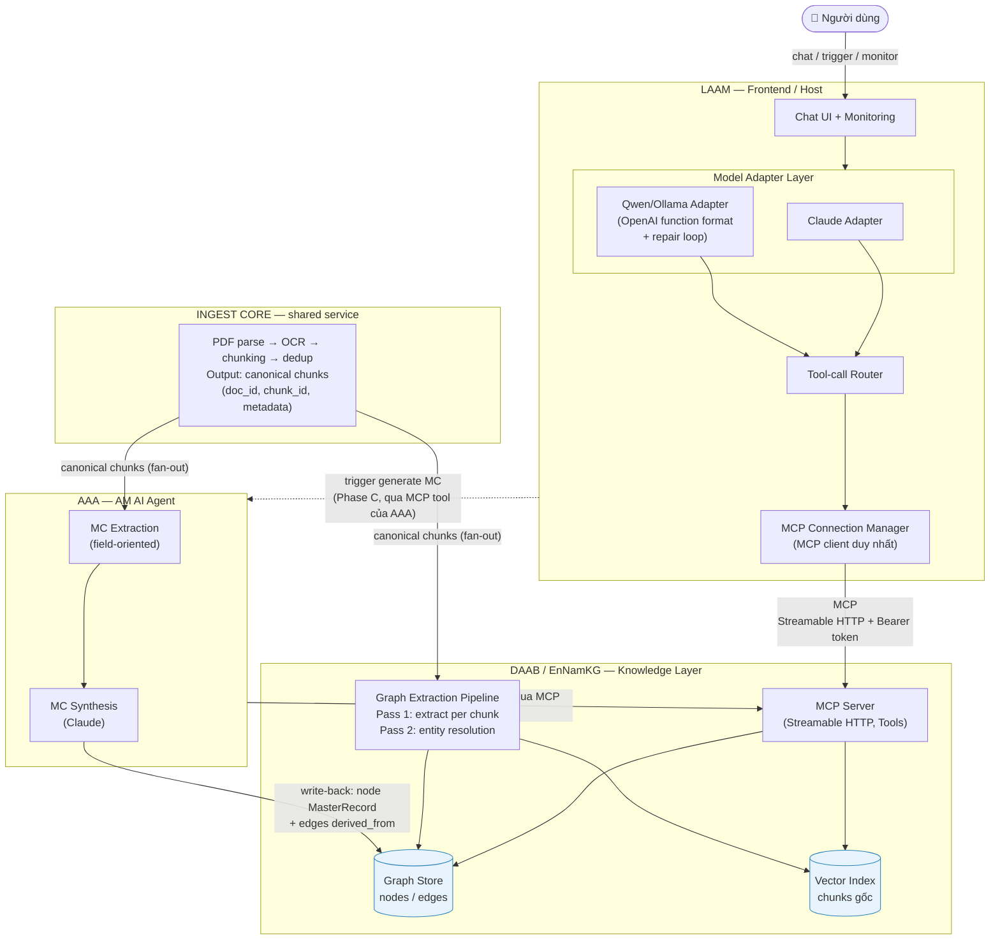

# Tài liệu Thiết kế Hệ sinh thái LAAM – DAAB – AAA

**Phiên bản:** 1.0 (Draft)
**Ngày:** 11/06/2026
**Tác giả:** CTO Office – Exnodes
**Trạng thái:** Chờ review

-----

## 1. Mục đích tài liệu

Tài liệu này mô tả kiến trúc tổng thể cho ba hệ thống hoạt động như một hệ sinh thái thống nhất:

|Hệ thống          |Tên đầy đủ               |Vai trò trong hệ sinh thái                                                                                                       |
|------------------|-------------------------|---------------------------------------------------------------------------------------------------------------------------------|
|**DAAB** (EnNamKG)|Knowledge Graph Platform |Tầng tri thức — nguồn sự thật duy nhất (single source of truth). Ingest tài liệu, phân giải thành nodes/edges, cung cấp MCP tools|
|**LAAM**          |Local AI Agent Monitoring|Mặt tiền hội thoại & giám sát — MCP client/host, hỗ trợ đa model (Claude, Qwen)                                                  |
|**AAA**           |AM AI Agent              |Pipeline tổng hợp — tiêu thụ tri thức từ DAAB, generate Master Record (MC) cho Project                                           |

Tài liệu trả lời ba câu hỏi:

1. Ba hệ thống kết nối với nhau như thế nào (kiến trúc, hợp đồng dữ liệu)?
1. MCP server của DAAB được xây dựng ra sao để phục vụ nhiều model (Claude, Qwen + Ollama)?
1. Lộ trình triển khai theo từng phase, với tiêu chí nghiệm thu rõ ràng?

-----

## 2. Nguyên tắc kiến trúc (Architecture Principles)

Mọi quyết định thiết kế trong tài liệu này tuân theo 5 nguyên tắc:

1. **Loosely coupled, không monolith.** Mỗi hệ thống giữ repo, deploy, vòng release riêng. Hợp đồng giữa chúng chỉ là MCP interface + data contracts.
1. **DAAB là nguồn sự thật duy nhất về tri thức.** Mọi tài liệu chỉ được ingest một lần. AAA và LAAM đều tiêu thụ tri thức qua DAAB, không tự duy trì bản sao.
1. **Thiết kế cho model yếu nhất.** Tool design lấy Qwen làm chuẩn nghiệm thu (lowest common denominator). Qwen pass thì Claude chắc chắn pass.
1. **Provenance xuyên suốt.** Mọi node, edge, master record đều truy vết được về `doc_id` / `chunk_id` / câu gốc. Không có provenance = không debug được, không gỡ được dữ liệu.
1. **Mọi tool call đều có log.** Một đường audit duy nhất cho tất cả tool calls, bất kể model nào phát sinh.

-----

## 3. Kiến trúc tổng thể

### 3.1. Sơ đồ hệ sinh thái

### 3.2. Luồng dữ liệu chính

**Luồng 1 — Ingest tài liệu (một lần, một cửa):**
Tài liệu PDF → Ingest Core (parse, OCR, chunking, dedup) → canonical chunks kèm `doc_id`/`chunk_id` → fan-out song song cho hai consumer: (a) DAAB chạy graph extraction ra nodes/edges, (b) AAA chạy field-oriented extraction phục vụ Master Record.

**Luồng 2 — Hội thoại qua LAAM:**
User hỏi → LAAM render tool definitions theo model đang chọn (Claude format hoặc OpenAI function format cho Qwen/Ollama) → model phát sinh tool call → tool-call router chuyển về MCP client duy nhất → DAAB MCP server thực thi → kết quả trả về model → trả lời user. Mọi bước được log.

**Luồng 3 — Generate Master Record:**
AAA nhận trigger (từ LAAM hoặc lịch batch) → query DAAB qua MCP tools (entities, relations, chunks liên quan đến Project) → Claude synthesize MC có cấu trúc kèm citation → ghi ngược MC vào DAAB dưới dạng node `MasterRecord` với edges `derived_from` trỏ về evidence nodes.

**Luồng 4 — Truy vết & giám sát:**
Từ LAAM, user hỏi “MC của Project X dựa trên tài liệu nào?” → traverse graph: `MasterRecord` → `derived_from` → entities → `evidence` → chunks → `doc_id`. Không cần tích hợp thêm vì tất cả đã nằm trong graph.

-----

## 4. Thiết kế từng thành phần

### 4.1. Ingest Core (shared service)

**Lý do tồn tại:** AAA và DAAB hiện có hai luồng ingest riêng. Duy trì hai bộ parser PDF là nợ kỹ thuật kép — cùng một tài liệu có thể ra hai kết quả parse khác nhau, dẫn đến MC và graph mâu thuẫn.

**Phạm vi (chỉ tầng 1 của pipeline):**

- Acquisition: nhận file, tính hash, dedup.
- Parsing: PDF → text/layout, OCR cho scan, tách section theo cấu trúc heading.
- Chunking: theo cấu trúc tài liệu (section-based), không fixed-size. Kèm context header (tên tài liệu + section) cho mỗi chunk.
- Output: **canonical document representation** — chunks chuẩn hóa kèm `doc_id`, `chunk_id`, layout metadata, hash.

**KHÔNG thuộc phạm vi:** entity extraction (việc của DAAB), field extraction (việc của AAA). Hai tầng enrichment này khác nhau có chủ đích và giữ riêng.

**Cơ chế fan-out:** giai đoạn đầu dùng gọi trực tiếp (synchronous); khi ổn định chuyển sang event/queue để một lần upload kích hoạt cả hai consumer độc lập.

**Chiến lược migration:** chọn luồng ingest đang xử lý PDF tốt hơn làm nền → trích phần parsing thành package/service riêng → trỏ luồng còn lại sang dùng core, giữ nguyên phần extraction của nó. Không đập AAA đang gần hoàn thành.

### 4.2. DAAB — Knowledge Layer + MCP Server

#### 4.2.1. Graph construction pipeline (2-pass)

- **Pass 1 — Extraction per chunk:** mỗi canonical chunk → LLM extract entities + relations + mô tả ngắn theo schema chặt. Áp dụng *gleaning* (hỏi lại 1-2 vòng “còn sót gì không”) để tăng recall. Dùng model rẻ (Haiku hoặc Qwen lớn chạy local trên RTX 5070 Ti) vì khối lượng lớn.
- **Pass 2 — Entity resolution & merge:** embedding similarity + LLM verify để merge entity trùng (“Nguyễn Văn A” / “Mr. A” / “ông A”). Tổng hợp lại description của node sau merge (summarize, không nối chuỗi). Dùng model mạnh vì sai ở đây lan ra toàn graph.
- **Incremental:** thêm tài liệu mới chỉ chạy extraction cho doc đó rồi resolution với graph hiện có; không rebuild toàn bộ.

#### 4.2.2. Schema (meta-types, domain-agnostic)

- **Node types (đóng):** `Person`, `Organization`, `Concept`, `Event`, `Document`, `Location`, `Artifact`, `Project`, `MasterRecord`. Mỗi node có `canonical_name`, `aliases[]`, `subtype` (free-text), `description`, `provenance[]`.
- **Relation types (đóng):** `works_for`, `part_of`, `mentions`, `causes`, `related_to`, `derived_from`, `evidence`. LLM không được tự sinh relation type mới — tránh hàng trăm type gần nghĩa làm graph không traverse được.
- **Provenance bắt buộc trên mọi node/edge:** `source_doc_id`, `chunk_id`, câu gốc. Một fact có nhiều evidence từ nhiều docs = tín hiệu confidence.
- **`MasterRecord` được định nghĩa trong schema ngay từ Phase 0** (kể cả khi AAA chưa ghi ngược) để tránh migrate graph sau này.

#### 4.2.3. MCP Server

**Về “chuẩn MCP”:** chỉ có một protocol nhưng nhiều phiên bản spec và transport:

|Hạng mục    |Các lựa chọn                                                                                      |Quyết định                                                                              |
|------------|--------------------------------------------------------------------------------------------------|----------------------------------------------------------------------------------------|
|Spec version|`2024-11-05`, `2025-03-26` (Streamable HTTP, OAuth), `2025-06-18` (structured output, elicitation)|Pin bản mới nhất SDK hỗ trợ; nâng version có kiểm soát                                  |
|Transport   |`stdio` (local 1-1), `HTTP+SSE` (deprecated), `Streamable HTTP` (chuẩn hiện tại)                  |`stdio` cho dev/test → `Streamable HTTP` cho production (LAAM ↔ DAAB là 2 service riêng)|
|Primitives  |Tools, Resources, Prompts                                                                         |Chỉ trông cậy **Tools** (Qwen không hỗ trợ tốt 2 cái còn lại)                           |
|SDK         |TypeScript `@modelcontextprotocol/sdk`, Python `mcp`                                              |TypeScript (đồng bộ stack Next.js) — pin version                                        |

**Tool catalog v1 (read-only):**

|Tool             |Tham số                                       |Mô tả                                                     |
|-----------------|----------------------------------------------|----------------------------------------------------------|
|`search_entities`|`query`, `type?` (enum), `limit?`             |Tìm entity theo tên/alias, hybrid keyword + embedding     |
|`get_entity`     |`entity_id`                                   |Chi tiết một entity kèm description tổng hợp và provenance|
|`get_relations`  |`entity_id`, `relation_type?` (enum), `limit?`|Các quan hệ của một entity                                |
|`search_chunks`  |`query`, `doc_id?`, `limit?`                  |Tìm chunks gốc theo vector — phục vụ câu hỏi chi tiết     |
|`get_document`   |`doc_id`                                      |Metadata tài liệu và danh sách chunks                     |

Phase sau bổ sung write tools (`upsert_master_record`…) với confirm flow phía client.

**Quy ước thiết kế tool (“mẫu số chung Qwen”):**

- Tên snake_case ngắn, ≤3 tham số bắt buộc, dùng enum thay free-text khi được.
- Description ≤2 câu, không nested object phức tạp.
- Response luôn có `limit` mặc định + pagination — KG query dễ trả về hàng nghìn nodes làm tràn context 32k của Qwen.
- Expose semantic operations, **không expose raw Cypher/SPARQL** — Qwen sẽ viết query sai liên tục.

**Bảo mật & vận hành:**

- Bearer token giữa LAAM ↔ DAAB và AAA ↔ DAAB; thiết kế sẵn chỗ cho per-user context.
- Health check, timeout, rate limit. Tools mutation (phase sau) phải idempotent vì LLM có thể retry.
- Log mọi tool call: tool name, args, latency, kích thước response, model phát sinh.

### 4.3. LAAM — Host & Model Adapter Layer

**Điểm mấu chốt:** Qwen/Ollama **không nói MCP trực tiếp**. Chỉ Claude có MCP client native. LAAM đóng vai MCP client duy nhất và dịch tool definitions sang format của từng model.

**Các thành phần:**

1. **MCP Connection Manager:** kết nối DAAB (và sau này AAA), fetch tool list, cache, refresh khi server thay đổi.
1. **Model Adapter interface** với 2 implementation:
- *ClaudeAdapter:* MCP tools → Anthropic `tools` format (map gần như 1:1).
- *QwenOllamaAdapter:* MCP tools → OpenAI function-calling format; flatten schema phức tạp; kiểm tra layer Ollama/vLLM hỗ trợ tool calling chuẩn.
1. **Repair loop (chủ yếu cho Qwen):** tool call parse fail hoặc sai tham số → trả error message cho model tự sửa, tối đa 2 vòng rồi báo user.
1. **Tool-call router:** mọi call từ cả hai adapter đi về cùng một MCP client → DAAB. Một đường audit duy nhất.
1. **Per-model metrics:** log tool call theo model — tỉ lệ chọn đúng tool, đúng tham số, số vòng repair. Số liệu này quyết định việc đơn giản hóa tool.

**Khi user switch model giữa Claude/Qwen:** tool definitions được re-render theo adapter tương ứng; conversation state giữ nguyên.

### 4.4. AAA — Master Record Pipeline

**Hiện trạng:** gần hoàn thành, tự ingest PDF và dùng Claude đọc trực tiếp. **Quyết định: ship bản hiện tại cho xong milestone**, sau đó chuyển nguồn input theo 2 bước:

- **Phase A (hiện tại):** AAA đọc PDF thô → Claude phân tích → generate MC. Giữ nguyên.
- **Phase B (sau khi Ingest Core + DAAB tools ổn định):** swap nguồn input — AAA query DAAB (entities, relations, chunks của Project) thay vì đọc PDF thô. Claude chuyển từ vai “đọc hiểu toàn bộ” sang “tổng hợp có cấu trúc”. Lợi ích: không trả tiền token lặp cho cùng tài liệu, MC có citation về node/chunk, nhất quán với graph.
- **Phase C:** ghi ngược MC vào DAAB — node `MasterRecord` + edges `derived_from` trỏ về evidence. AAA expose một MCP tool (`generate_master_record`) để LAAM trigger được run.

Vì AAA đã tích hợp Claude sẵn, việc đổi nguồn context là thay đổi khoanh vùng được, không phải rewrite.

-----

## 5. Hợp đồng dữ liệu (Data Contracts)

Đây là phần “keo dán” của hệ sinh thái — quan trọng hơn cả code chung:

|Contract                             |Nội dung                                                       |Ai sở hữu                                   |Ai tiêu thụ|
|-------------------------------------|---------------------------------------------------------------|--------------------------------------------|-----------|
|**Canonical Document Representation**|`doc_id`, `chunk_id`, text, section path, layout metadata, hash|Ingest Core                                 |DAAB, AAA  |
|**Graph Schema**                     |Node types, relation types, provenance format                  |DAAB                                        |LAAM, AAA  |
|**MCP Tool Contracts**               |Tool names, schemas, response formats, error formats           |DAAB (và AAA phase C)                       |LAAM, AAA  |
|**MasterRecord Schema**              |Cấu trúc trường của MC, quan hệ `derived_from`                 |AAA đề xuất, DAAB phê duyệt vào graph schema|LAAM       |

Quy tắc thay đổi contract: backward-compatible trong cùng major version; breaking change phải thông báo cho mọi consumer và có giai đoạn chạy song song.

-----

## 6. Lộ trình triển khai

### Phase 0 — Nền móng (tuần 1)

- Chốt tool catalog v1 trên giấy, quy ước thiết kế tool theo chuẩn Qwen.
- Chốt graph schema bao gồm node `MasterRecord` + `derived_from` ngay từ đầu.
- Chọn SDK (TypeScript), pin spec version.
- **DoD:** tài liệu này được approve; schema review xong.

### Phase 1 — DAAB MCP skeleton + stdio (tuần 1-2)

- Server stdio, 2 tools đầu wrap API sẵn có (không query graph trực tiếp).
- Test bằng MCP Inspector — chưa cần model.
- **DoD:** tools trả JSON đúng schema, error rõ ràng, response cắt theo limit.

### Phase 2 — Validate với Claude (tuần 2-3)

- Cắm vào Claude Desktop/Code qua stdio; hoàn thiện đủ 5 tools read-only.
- Tinh chỉnh description theo cách Claude thực gọi. Bật logging đầy đủ.
- **DoD:** Claude trả lời đúng bộ 10 câu hỏi mẫu end-to-end.

### Phase 3 — Streamable HTTP + auth (tuần 3-4)

- Chuyển transport, bearer token, health check, timeout, rate limit.
- **DoD:** LAAM gọi DAAB qua HTTP từ máy khác thành công, có audit log.

### Phase 4 — LAAM Adapter Layer (tuần 4-6) ⚠ phần khó nhất

- MCP Connection Manager, ClaudeAdapter, QwenOllamaAdapter, repair loop, tool-call router.
- **DoD:** switch model giữa hội thoại hoạt động; Qwen gọi được tối thiểu 4/5 tools với repair ≤2 vòng.

### Phase 5 — Test matrix + hardening (tuần 6-7)

- Bộ 10-20 câu hỏi cố định chạy trên cả 2 model; đo tỉ lệ đúng tool/tham số/số vòng repair.
- Tool nào Qwen fail nhiều → tách nhỏ hoặc đơn giản hóa.
- **Quy tắc nghiệm thu: Qwen pass thì mới release.**

### Phase 6 — Ingest Core (song song từ tuần 4, hoàn tất tuần 8-10)

- Trích parsing từ luồng tốt hơn thành service riêng → trỏ luồng còn lại sang dùng.
- **DoD:** cùng một PDF cho ra cùng canonical chunks cho cả DAAB và AAA.

### Phase 7 — AAA hội nhập ecosystem (tuần 10-14)

- Phase B: AAA đổi nguồn input sang DAAB tools.
- Phase C: write-back `MasterRecord`; AAA expose tool `generate_master_record`; LAAM trigger được.
- **DoD:** từ LAAM truy vết được MC → evidence → tài liệu gốc hoàn chỉnh.

### Phase 8 — Mở rộng (sau ổn định)

- Write tools với confirm flow; per-user permission; event/queue cho fan-out; theo dõi spec MCP mới.

-----

## 7. Rủi ro & biện pháp

|Rủi ro                                            |Mức độ    |Biện pháp                                                                              |
|--------------------------------------------------|----------|---------------------------------------------------------------------------------------|
|Qwen gọi tool sai schema thường xuyên             |Cao       |Tool design theo chuẩn Qwen từ đầu; repair loop; test matrix Phase 5; metrics per-model|
|KG response tràn context Qwen (32k)               |Cao       |`limit` mặc định + pagination bắt buộc trên mọi tool                                   |
|Hai luồng ingest tiếp tục phân kỳ trước khi merge |Trung bình|Chốt canonical representation (contract) ngay Phase 0, kể cả khi code chưa chung       |
|Entity resolution sai làm graph nhiễm bẩn         |Cao       |Pass 2 dùng model mạnh; giữ provenance để rollback theo doc; review mẫu định kỳ        |
|Refactor AAA gây trễ milestone                    |Trung bình|Ship AAA bản hiện tại trước; chỉ swap nguồn input ở Phase 7                            |
|Spec MCP thay đổi nhanh                           |Trung bình|Pin SDK version; nâng cấp có kiểm soát theo changelog                                  |
|Prompt injection khiến model gọi tool ngoài ý muốn|Trung bình|Phase 1-6 chỉ read-only; write tools (Phase 8) bắt buộc confirm flow + idempotent      |

-----

## 8. Quyết định cần chốt sớm (Open Decisions)

1. **Graph store:** Neo4j hay tự build trên Postgres (pgvector + bảng quan hệ)? Ảnh hưởng tool implementation Phase 1.
1. **Model cho extraction Pass 1:** Claude Haiku (API, ổn định) hay Qwen local trên RTX 5070 Ti (rẻ, cần benchmark chất lượng)?
1. **Cấu trúc MasterRecord:** schema cố định cho mọi Project hay template theo loại Project? Cần chốt trước Phase 7, lý tưởng là phác thảo ngay Phase 0.
1. **Luồng ingest nào làm nền cho Ingest Core:** cần so sánh cụ thể chunking strategy và OCR engine của AAA vs DAAB.

-----

*Tài liệu này là bản draft để team review. Mọi góp ý về tool catalog, schema, và thứ tự phase gửi về CTO Office trước khi khởi động Phase 0.*